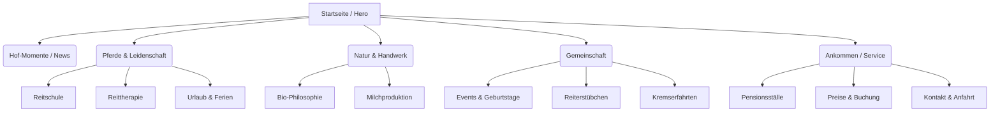
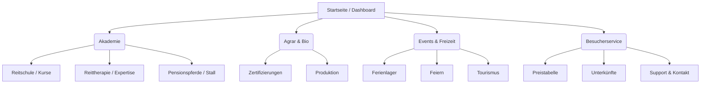

# Biohof Mühlenberg - Sitemap & User Flows

Dieses Dokument visualisiert die Struktur der neuen Webseite für beide Konzepte.

## 1. Sitemap (Konzept 1: Erlebnishof)

## 2. Sitemap (Konzept 2: Kompetenz-Campus)

## 3. Core User Flow: Reitstunde buchen
1. **Einstieg:** User landet auf Startseite (Hero-CTA) oder Reitschul-Unterseite.
2. **Information:** Prüfung der Level/Preise auf der Seite.
3. **Aktion:** Klick auf "Jetzt Buchen" (Sticky Button).
4. **Checkout:** Weiterleitung zum spezialisierten Buchungssystem (z.B. Reitbuch.com).
5. **Bestätigung:** Rückleitung auf eine "Danke"-Seite mit Anfahrtsbeschreibung.
